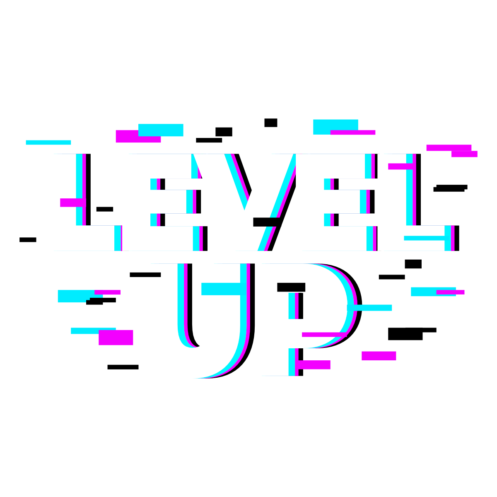
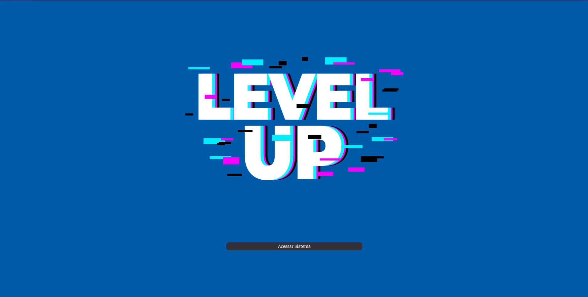
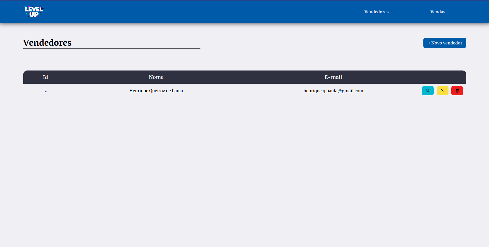
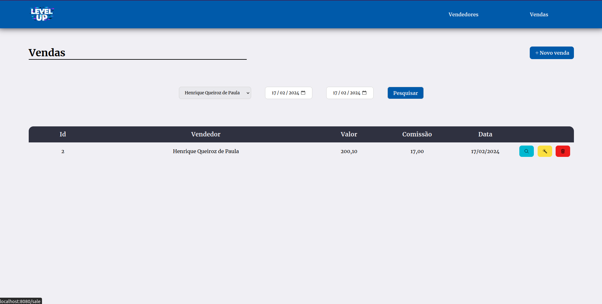
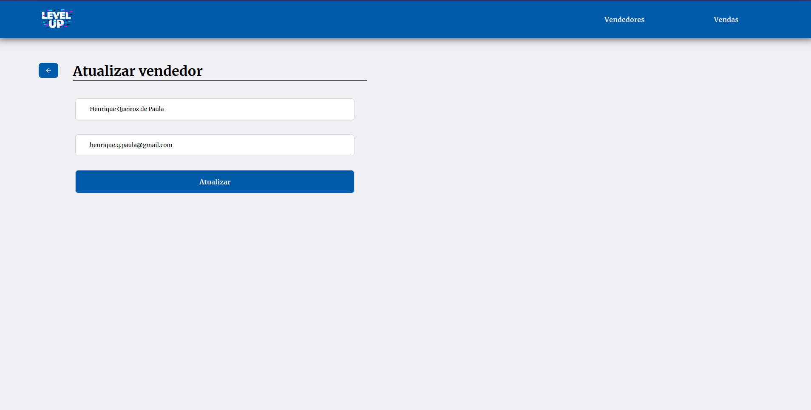

<!-- Banner -->

    

<h1 align="center">Level Up!</h1>

🛒Sistema para cadastro e gerenciamento de vendas🛒

<!-- Badges -->

<h4 align="center">✅  Finalizado  ✅</h4>

    <a href="#objetivo">Objetivo</a> •
    <a href="#roadmap">Roadmap</a> •
    <a href="#prototipacao">Prototipação</a> •
    <a href="#executando_projeto">Executando projeto</a>

    <h2>Objetivo</h2>
    
"Level Up" é uma plataforma para cadastro de vendedores e suas respectivas vendas, o desafio explorou tecnologias como PHP, Laravel e MySQL. A ideia era criar um CRUD (Create, Read, Update e Delete) para Vendedores e Vendas, assim como o agendamento de uma rotina de e-mail.

    <h2>Roadmap</h2>
    <h3>Funcionalidades:</h3>
    <ul>
        <li>[Create] - Cadastro de vendedores;</li>
        <li>[Read] - Listagem de vendedores;</li>
        <li>[Update] - Atualização de vendedores;</li>
        <li>[Delete] - Exclusão de vendedores;</li>
        <li>[Create] - Cadastro de vendas;</li>
        <li>[Read] - Listagem de vendas;</li>
        <li>[Update] - Atualização de vendas;</li>
        <li>[Delete] - Exclusão de vendas;</li>
        <li>Calculo de comissão de venda;</li>
        <li>Rotina de envio de relatórios diários.</li>
    </ul>
    <h3>Banco de Dados (DER)</h3> 
    

        
    

    <h2>Prototipação</h2>
     

         
         
         
        
     

